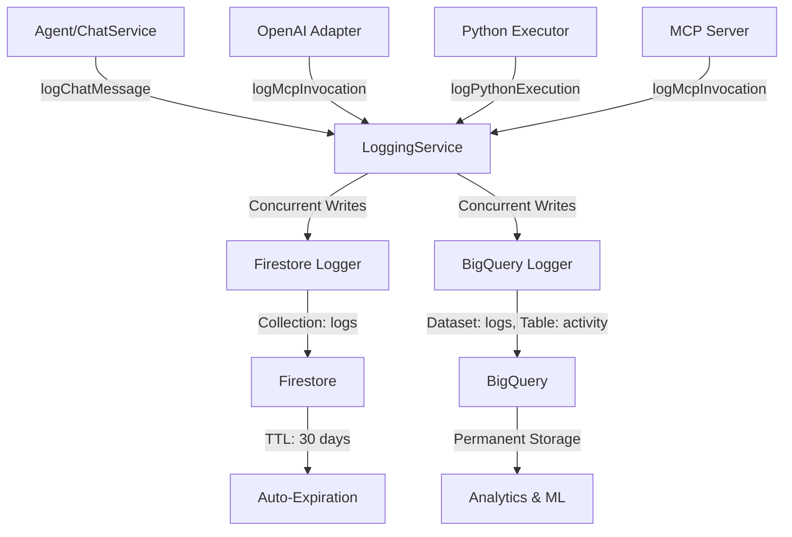
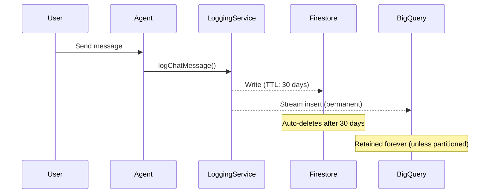

# Logging System

Comprehensive dual-write logging system that captures all user interactions, AI responses, tool invocations, and code executions to both Firestore (recent, queryable) and BigQuery (long-term analytics).

## Architecture Overview



### Key Design Decisions

**Dual-Write Pattern**: All logs are written to both Firestore and BigQuery concurrently using `Promise.allSettled()`. This ensures:
- Recent logs are immediately queryable in Firestore
- All logs are preserved in BigQuery for long-term analysis
- Failures in one logger do not block the other

**Non-Blocking**: Logging failures are caught and logged to Cloud Logging but never throw errors that would break the application.

**TTL-Based Expiration**: Firestore logs include an `expiresAt` field set to 30 days in the future. Firestore's TTL policy automatically deletes expired documents.

---

## Schema Definitions

### Base Log Entry

All log entries share these common fields:

| Field | Type | Description |
|-------|------|-------------|
| `timestamp` | number | Unix timestamp in milliseconds |
| `userId` | string | User ID who triggered the event |
| `sessionId` | string | Chat session ID |
| `logType` | string | Type of log entry (see below) |
| `level` | string | Log level: 'debug', 'info', 'warn', 'error' |
| `environment` | string | 'development', 'staging', or 'production' |
| `version` | string | Application version |
| `metadata` | object | Optional additional context |

### Log Types

#### 1. Chat Logs (`logType: 'chat'`)

Captures all messages in a conversation.

**Additional Fields**:
- `role`: 'user' | 'assistant' | 'system' | 'tool'
- `content`: Message text
- `messageId`: Optional unique message identifier
- `toolCalls`: Array of tool call objects (for assistant messages that invoke tools)
- `toolCallId`: ID of the tool call this message responds to (for tool messages)

**Example**:
```json
{
  "timestamp": 1732780800000,
  "userId": "user123",
  "sessionId": "session456",
  "logType": "chat",
  "level": "info",
  "environment": "production",
  "version": "0.1.0",
  "role": "user",
  "content": "What are the current Polymarket odds on the election?"
}
```

#### 2. MCP Invocation Logs (`logType: 'mcpInvocation'`)

Tracks every MCP tool execution.

**Additional Fields**:
- `toolName`: Name of the tool executed
- `arguments`: Tool input parameters (object)
- `result`: Tool output (if successful)
- `error`: Error message (if failed)
- `durationMs`: Execution time in milliseconds
- `success`: Boolean indicating success/failure

**Example**:
```json
{
  "timestamp": 1732780801000,
  "userId": "user123",
  "sessionId": "session456",
  "logType": "mcpInvocation",
  "level": "info",
  "environment": "production",
  "version": "0.1.0",
  "toolName": "get_market_odds",
  "arguments": {"marketId": "election-2024"},
  "result": {"odds": 0.52},
  "durationMs": 342,
  "success": true
}
```

#### 3. Python Execution Logs (`logType: 'pythonExecution'`)

Logs all Python code executions.

**Additional Fields**:
- `code`: Python code executed
- `inputData`: Input data passed to the code (object)
- `output`: Standard output from execution
- `error`: Error message (if failed)
- `durationMs`: Execution time in milliseconds
- `success`: Boolean indicating success/failure

#### 4. Agent Action Logs (`logType: 'agentAction'`)

Tracks high-level agent behaviors (debugging/telemetry).

**Additional Fields**:
- `action`: Action name (e.g., 'thinking', 'tool_selection')
- `details`: Freeform object with action-specific data

#### 5. Session Logs (`logType: 'sessionStart' | 'sessionEnd'`)

Tracks session lifecycle.

**Additional Fields**:
- `customInstructions`: User's custom instructions (sessionStart)
- `totalMessages`: Message count (sessionEnd)
- `totalTools`: Tool invocation count (sessionEnd)

---

## Data Storage

### Firestore

**Collection**: `logs`

**Structure**:
```
/logs/{auto-generated-id}
  - ... all log entry fields ...
  - expiresAt: ISO 8601 timestamp (now + 30 days)
  - createdAt: ISO 8601 timestamp
```

**Indexes** (create in Firebase Console if needed):
- `userId` (ascending), `timestamp` (descending)
- `sessionId` (ascending), `timestamp` (ascending)
- `logType` (ascending), `timestamp` (descending)
- `level` (ascending), `timestamp` (descending)

**TTL Policy**: Firestore automatically deletes documents where `expiresAt` < current time.

**Retention**: 30 days (configurable via `LOG_RETENTION_DAYS` env var)

### BigQuery

**Dataset**: `logs` (configurable via `BIGQUERY_DATASET_ID`)

**Table**: `activity` (configurable via `BIGQUERY_TABLE_ID`)

**Schema**: The BigQuery table uses a **wide schema** with nullable fields for all log types:

- Common fields: `timestamp`, `userId`, `sessionId`, `logType`, `level`, `environment`, `version`, `metadata`
- Chat-specific: `chat_role`, `chat_content`, `chat_messageId`, `chat_toolCalls`, `chat_toolCallId`
- MCP-specific: `mcp_toolName`, `mcp_arguments`, `mcp_result`, `mcp_error`, `mcp_durationMs`, `mcp_success`
- Python-specific: `python_code`, `python_inputData`, `python_output`, `python_error`, `python_durationMs`, `python_success`
- Agent-specific: `agent_action`, `agent_details`
- Session-specific: `session_customInstructions`, `session_totalMessages`, `session_totalTools`

**Partitioning**: Recommended to partition by `timestamp` (day) for cost efficiency. Set up via:
```sql
CREATE TABLE `<project-id>.logs.activity`
PARTITION BY DATE(timestamp)
OPTIONS(
  partition_expiration_days=365
)
```

**Retention**: Permanent by default. Use partition expiration for automatic cleanup if needed.

---

## Integration Guide

### Where Logging is Implemented

| Component | File | What's Logged |
|-----------|------|---------------|
| **OpenAI Adapter** | [`adapters/openai/OpenAIAdapter.ts`](file:///Users/sirishjoshi/Desktop/DREAGLE-BACKEND/src/adapters/openai/OpenAIAdapter.ts) | User messages, assistant responses, tool calls with timing |
| **Chat Service** | [`app/agent/ChatService.ts`](file:///Users/sirishjoshi/Desktop/DREAGLE-BACKEND/src/app/agent/ChatService.ts) | Session start events |
| **Python Execution** | [`adapters/pythonExecution.ts`](file:///Users/sirishjoshi/Desktop/DREAGLE-BACKEND/src/adapters/pythonExecution.ts) | Code execution, results, errors (planned) |
| **MCP Server** | [`mcp/polymarketRead.ts`](file:///Users/sirishjoshi/Desktop/DREAGLE-BACKEND/src/mcp/polymarketRead.ts) | Tool invocations (via OpenAI Adapter) |

### How to Add Logging to New Code

1. **Inject LoggingService** into your class/function:
   ```typescript
   constructor(
       // ... other dependencies
       private loggingService?: LoggingService
   ) {}
   ```

2. **Call appropriate logging method**:
   ```typescript
   await this.loggingService?.logChatMessage(userId, sessionId, 'user', message);
   await this.loggingService?.logMcpInvocation(userId, sessionId, toolName, args, result);
   await this.loggingService?.logPythonExecution(userId, sessionId, code, result);
   ```

3. **Use optional chaining (`?.`)** to make logging gracefully degrade if not configured.

### Initializing LoggingService

See [`entrypoints/agent.ts`](file:///Users/sirishjoshi/Desktop/DREAGLE-BACKEND/src/entrypoints/agent.ts) for initialization example:

```typescript
import { loadConfig } from '../config/env';
import { LoggingService } from '../app/logging/LoggingService';
import { createFirestoreLogger } from '../adapters/logging/FirestoreLogger';
import { createBigQueryLogger } from '../adapters/logging/BigQueryLogger';
import { getFirestore } from 'firebase-admin/firestore';

const config = loadConfig();

const loggers = [
    createFirestoreLogger({
        firestore: getFirestore(),
        retentionDays: config.logging.retentionDays,
    }),
];

if (config.logging.bigQueryProjectId) {
    loggers.push(createBigQueryLogger({
        projectId: config.logging.bigQueryProjectId,
        datasetId: config.logging.bigQueryDatasetId,
        tableId: config.logging.bigQueryTableId,
    }));
}

const loggingService = new LoggingService({
    loggers,
    environment: config.logging.environment,
    version: config.logging.version,
    minLogLevel: config.logging.logLevel,
});
```

---

## Query Examples

### Firestore Queries

**Get recent messages for a user:**
```typescript
const logs = await firestore.collection('logs')
    .where('userId', '==', 'user123')
    .where('logType', '==', 'chat')
    .orderBy('timestamp', 'desc')
    .limit(50)
    .get();
```

**Get all logs for a session:**
```typescript
const logs = await firestore.collection('logs')
    .where('sessionId', '==', 'session456')
    .orderBy('timestamp', 'asc')
    .get();
```

**Get errors in the last hour:**
```typescript
const oneHourAgo = Date.now() - 3600000;
const errors = await firestore.collection('logs')
    .where('level', '==', 'error')
    .where('timestamp', '>=', oneHourAgo)
    .get();
```

### BigQuery Queries

**Most used MCP tools (last 7 days):**
```sql
SELECT 
    mcp_toolName,
    COUNT(*) as invocations,
    AVG(mcp_durationMs) as avg_duration_ms,
    SUM(CASE WHEN mcp_success THEN 1 ELSE 0 END) / COUNT(*) as success_rate
FROM `<project-id>.logs.activity`
WHERE logType = 'mcpInvocation'
  AND timestamp >= TIMESTAMP_SUB(CURRENT_TIMESTAMP(), INTERVAL 7 DAY)
GROUP BY mcp_toolName
ORDER BY invocations DESC
```

**User engagement analysis:**
```sql
SELECT 
    userId,
    COUNT(DISTINCT sessionId) as total_sessions,
    COUNT(CASE WHEN logType = 'chat' AND chat_role = 'user' THEN 1 END) as user_messages,
    COUNT(CASE WHEN logType = 'mcpInvocation' THEN 1 END) as tool_uses
FROM `<project-id>.logs.activity`
WHERE timestamp >= TIMESTAMP_SUB(CURRENT_TIMESTAMP(), INTERVAL 30 DAY)
GROUP BY userId
ORDER BY total_sessions DESC
```

**Error trend analysis:**
```sql
SELECT 
    DATE(timestamp) as date,
    logType,
    COUNT(*) as error_count
FROM `<project-id>.logs.activity`
WHERE level = 'error'
GROUP BY date, logType
ORDER BY date DESC, error_count DESC
```

---

## Onboarding Guide for New Developers

### Where to Find Logs

**Recent logs (last 30 days)**:
1. Open [Firebase Console](https://console.firebase.google.com)
2. Select your project
3. Navigate to Firestore Database
4. Open the `logs` collection
5. Use filters to search by `userId`, `sessionId`, `logType`, etc.

**Historical logs & analytics**:
1. Open [BigQuery Console](https://console.cloud.google.com/bigquery)
2. Navigate to your project → `logs` dataset → `activity` table
3. Use SQL queries to analyze data

### Debugging a User Issue

1. **Get the userId and/or sessionId** from the user report
2. **Check recent Firestore logs**:
   - Filter by `userId` or `sessionId`
   - Look at `logType: 'chat'` to see the conversation
   - Check `logType: 'mcpInvocation'` for tool call failures
   - Look for `level: 'error'` entries
3. **For older issues**, query BigQuery with the sessionId
4. **Reproduce locally** using the [`scripts/test-agent-manual.ts`](file:///Users/sirishjoshi/Desktop/DREAGLE-BACKEND/scripts/test-agent-manual.ts) script

### Understanding Log Lifecycle



---

## Cost Management

### Current Costs (Estimated)

**Firestore** (30-day retention):
- Storage: ~$0.18/GB/month
- Reads: $0.06 per 100k documents
- Writes: $0.18 per 100k documents
- **Expected**: <$5/month for typical usage (10k logs/day)

**BigQuery**:
- Storage: $0.02/GB/month (after 90-day free tier)
- Queries: $5/TB scanned
- Streaming inserts: Free
- **Expected**: <$2/month for storage, variable for queries

**Total**: ~$7-10/month for moderate usage

### Reducing Costs

1. **Adjust Firestore TTL**: Set `LOG_RETENTION_DAYS=7` to reduce storage
2. **Filter log level**: Set `LOG_LEVEL=info` in production to skip debug logs
3. **BigQuery partitioning**: Use partition expiration to auto-delete old data
4. **Query optimization**: Use `WHERE` clauses on indexed/partitioned fields
5. **Sampling**: For high-volume production, implement sampling (log 10% of requests)

---

## Maintenance & Troubleshooting

### Monitoring Logging Health

**Check for logging failures** (Cloud Logging):
```
resource.type="cloud_function"
jsonPayload.message=~"LoggingService|FirestoreLogger|BigQueryLogger"
severity>=ERROR
```

**Common issues**:
- **"Permission denied" in BigQuery**: Grant `roles/bigquery.dataEditor` to Firebase service account
- **"Collection not found" in Firestore**: Collection is auto-created on first write
- **High latency**: Logging adds ~50-100ms per request; ensure `Promise.allSettled` is used for non-blocking writes

### Schema Evolution

**Adding new fields**:
1. Update type definitions in [`core/logging/types.ts`](file:///Users/sirishjoshi/Desktop/DREAGLE-BACKEND/src/core/logging/types.ts)
2. Update flattening logic in [`adapters/logging/BigQueryLogger.ts`](file:///Users/sirishjoshi/Desktop/DREAGLE-BACKEND/src/adapters/logging/BigQueryLogger.ts)
3. Add new columns to BigQuery table (nullable, so no migration needed)
4. Update this documentation

**Firestore** handles schema changes automatically (NoSQL).

**BigQuery** allows adding nullable columns without breaking existing queries.

---

## Environment Variables

Add these to `.env.local`:

```bash
# BigQuery Configuration
BIGQUERY_PROJECT_ID=your-gcp-project-id
BIGQUERY_DATASET_ID=logs
BIGQUERY_TABLE_ID=activity

# Logging Configuration
LOG_RETENTION_DAYS=30
LOG_LEVEL=info
NODE_ENV=production
APP_VERSION=0.1.0
```

For local development:
- Omit `BIGQUERY_PROJECT_ID` to disable BigQuery logging (Firestore only)
- Set `LOG_LEVEL=debug` for verbose logging
- Set `NODE_ENV=development`

---

## Best Practices

1. **Always use optional chaining** (`?.`) when calling logging methods
2. **Never await logging** in performance-critical paths; LoggingService is already async
3. **Include userId and sessionId** in every log entry for traceability
4. **Use appropriate log levels**: debug for development, info for production events, error for failures
5. **Don't log PII** in `metadata` fields unless necessary and properly secured
6. **Test logging** in development before deploying to production
7. **Monitor costs** monthly via GCP billing dashboard

---

## Related Documentation

- [Backend Functions](file:///Users/sirishjoshi/Desktop/DREAGLE-BACKEND/docs/Backend-functions.md) - Function deployment details
- [Architecture](file:///Users/sirishjoshi/Desktop/DREAGLE-BACKEND/docs/architecture.md) - Overall system architecture
- [IAM Policy](file:///Users/sirishjoshi/Desktop/DREAGLE-BACKEND/docs/iam-policy.md) - Access control and security
- [Testing Strategy](file:///Users/sirishjoshi/Desktop/DREAGLE-BACKEND/docs/testing-strategy.md) - How to test logging
